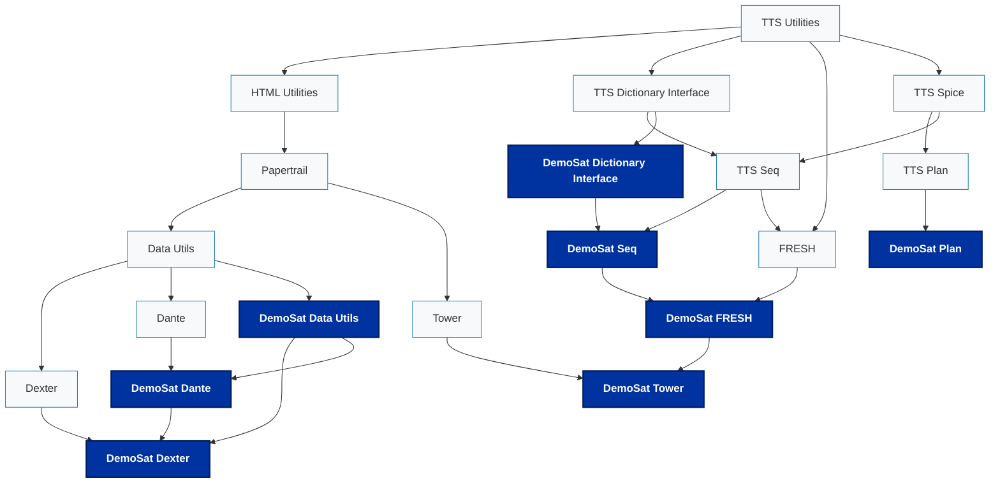

# Architecture

This page shows a high-level heirarchy of the interdependencies of all TTS libraries, including the DemoSat adaptation layer.
It is not meant to strictly match the pip resolution of all packages. For example, TTS Utilities is required by every TTS library
(it's where our shared logger lives) but it is only illustrated as flowing to its direct children. Any node in this diagram
may depend on any of those in the flow of the heirarchy above it. Some depenencies are not illustrated because the diagram gets too
messy as more and more are added. Illustrating the general inheritance strategy is more important here than creating an image that
is exhaustively correct.

---
<a href="https://github.com/NASA-JPL-Teamtools-Studio/teamtools_documentation/blob/main/docs/architecture.md" target="_blank" rel="noopener noreferrer">Edit/Comment on GitHub</a>