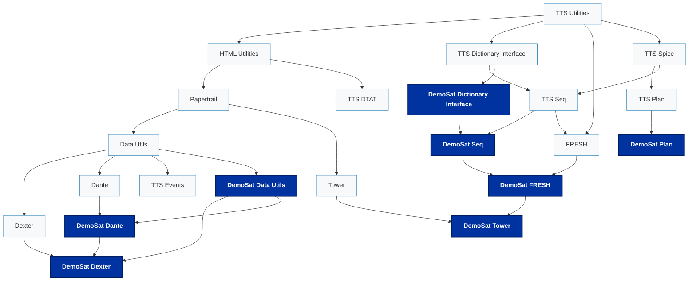
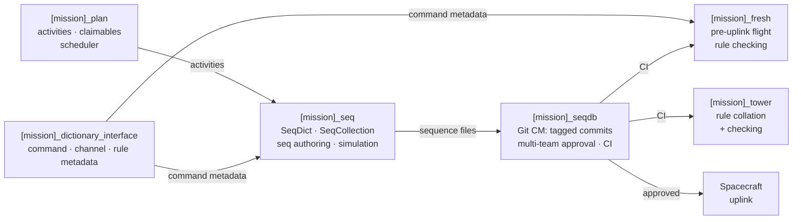
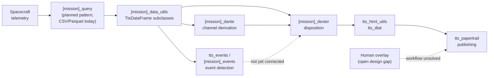

# Architecture

This page describes the structure of TTS libraries, how they relate to each other, and how data moves through them at runtime. The dependency graph shows library relationships; the operational flow sections describe runtime data movement.

## Naming Conventions

All TTS repositories follow a consistent naming pattern:

- **`tts_*`** — core library. No mission-specific code. Provides abstract base classes and multimission implementations that any project can extend.
- **`[mission]_*`** — mission adaptation. Extends one or more `tts_*` cores for a specific project. Depends on TTS core; never modifies it.
- **`[mission]_seqdb`** — a special case: not a Python package. A Git repository template for strict configuration management of flight sequence files. See the Uplink Chain section below.

The `demosat_*` group (`NASA-JPL-TTS-Demosat`) is the canonical reference implementation — a fictional satellite demonstrating a complete end-to-end TTS adaptation. Start with DemoSat when learning how to adapt any TTS library for a new mission.

## Dependency Graph

Not every dependency is shown — `tts_utilities` is required by every library, but only its direct dependents are illustrated. The intent is to convey the general inheritance and dependency strategy, not exhaustive pip resolution.

```mermaid
graph TD;
    %% Core
    A[TTS Utilities] --> C[HTML Utilities];
    A --> D[TTS Dictionary Interface];
    D --> B[TTS Seq];
    A --> E[FRESH];
    C --> F[Papertrail];
    C --> V[TTS DTAT];
    F --> G[Data Utils];
    G --> H[Dexter];
    G --> I[Dante];
    G --> U[TTS Events];
    E --> J[DemoSat FRESH];
    F --> K[Tower];
    H --> L[DemoSat Dexter];
    I --> M[DemoSat Dante];
    K --> N[DemoSat Tower];
    D --> O[DemoSat Dictionary Interface];
    G --> P[DemoSat Data Utils];
    B --> Q[DemoSat Seq];
    A --> R[TTS Spice];
    R --> S[TTS Plan];
    S --> T[DemoSat Plan];
    M --> L;
    R --> B;
    P --> L;
    P --> M;
    O --> Q;
    B --> E;
    Q --> J;
    J --> N;

    %% Utility Nodes
    classDef utility fill:#f8f9fb,stroke:#2980b9,stroke-width:1px,color:#333;
    class A,B,C,D,E,F,G,H,I,K,R,S,U,V utility;

    %% NASA Blue for DemoSat Nodes
    classDef demosat fill:#0032A0,stroke:#001d5e,stroke-width:2px,color:#fff,font-weight:bold;
    class J,L,M,N,O,P,Q,T demosat;
```

## Uplink Chain

The uplink chain begins with activity planning and ends with sequences authorized for upload to the spacecraft. Tower and FRESH may run in parallel during CI; dictionary lookups are used by multiple steps simultaneously.

```mermaid
flowchart LR
    Plan["[mission]_plan\nactivities · claimables\nscheduler"]
    Seq["[mission]_seq\nSeqDict · SeqCollection\nseq authoring · simulation"]
    DI["[mission]_dictionary_interface\ncommand · channel · rule metadata"]
    SeqDB["[mission]_seqdb\nGit CM: tagged commits\nmulti-team approval · CI"]
    Fresh["[mission]_fresh\npre-uplink flight\nrule checking"]
    Tower["[mission]_tower\nrule collation\n+ checking"]
    SC["Spacecraft\nuplink"]

    Plan -->|activities| Seq
    DI -->|command metadata| Seq
    DI -->|command metadata| Fresh
    Seq -->|sequence files| SeqDB
    SeqDB -->|CI| Fresh
    SeqDB -->|CI| Tower
    SeqDB -->|approved| SC
```

**Key concepts:**

- **`[mission]_plan`** — defines mission-specific `Activity` subclasses with start/stop times and resource claims. The scheduler is entirely mission-side; `tts_plan` provides abstract activity and claim types.
- **`[mission]_seq`** — authors and parses sequences. `SeqDict` represents one sequence file. `SeqCollection` is a graph of sequences linked by calling relationships (e.g., `RUN_SEQ`). The `CALLING_COMMANDS` class variable declares which command stems spawn sub-sequences and which argument carries the child ID. `SeqCollection` powers call tree reports and broken-link detection. Mission-specific sequence classes also carry metadata fields such as `on_board_path` (intended onboard destination) and `deletion_intent` (mark for removal during the next uplink load).
- **`[mission]_seqdb`** — a Git repository (not a Python package). Enforces: tagged commit before any PR can merge; multi-team approval gates (ops, mission assurance, management); and automated CI validation (FRESH, Tower, call tree reports, metadata diffs). The merged tagged commit is the authorized source of truth for what sequences are onboard.
- **Tower** can collate results from external tools via input clients, check rules directly in checkers, or do both simultaneously. All modes are valid depending on mission context.
- **FRESH** checks per-sequence flight rules. Rules are Python functions/classes organized into modules by category (argument rules, existence rules, timing rules, etc.).

## Downlink Web

The downlink side is a web, not a pipeline — tools can run independently, in any combination, and results feed into each other non-linearly.

```mermaid
flowchart LR
    TLM["Spacecraft\ntelemetry"]
    Q["[mission]_query\n(planned pattern;\nCSV/Parquet today)"]
    DU["[mission]_data_utils\nTtsDataFrame subclasses"]
    Dante["[mission]_dante\nchannel derivation"]
    Events["tts_events /\n[mission]_events\nevent detection"]
    Dexter["[mission]_dexter\ndisposition"]
    HTML["tts_html_utils\ntts_dtat"]
    PT["tts_papertrail\npublishing"]
    Human["Human overlay\n(open design gap)"]

    TLM --> Q
    Q --> DU
    DU --> Dante
    DU --> Events
    DU --> Dexter
    Dante --> Dexter
    Events -.->|not yet connected| Dexter
    Dexter --> HTML
    HTML --> PT
    Human -.->|workflow unsolved| PT
```

**Key concepts:**

- **`[mission]_query`** (a naming convention for a not-yet-standardized layer) — reads raw telemetry from files or databases and returns typed `TtsDataFrame` subclasses. No analysis logic lives here. Currently a CSV/Parquet placeholder in DemoSat; TimeScaleDB is the planned optional backend.
- **`[mission]_data_utils`** — defines mission-specific `TtsDataFrame` subclasses (EHA, EVRs, comm windows, orbit events, etc.). Does not do I/O.
- **`[mission]_dante`** — derives new channels from existing telemetry using the expression engine in `tts_data_utils`.
- **`tts_events`** / **`[mission]_events`** — detects time periods of interest from telemetry by rule-based detection. Distinct from EVRs (discrete log records). Not yet connected to Dexter as a disposition input — a filed roadmap item.
- **`[mission]_dexter`** — dispositions data items using auto-disposition rule tables and human overlay. Human overlay workflow is an open design gap.
- **`tts_papertrail`** — publishes completed reports to external destinations (Confluence, Cacher, Excel, etc.).

## Tower's Four-Class Model

Every Tower mission implementation is built from four concepts:

| Class | Role |
|---|---|
| **Input client** | Translates an external tool's output (any format) into Tower's internal representation. Can depend on other input clients. |
| **Checker** | Evaluates flight rules against input clients; stamps dispositions onto rule results. |
| **Rule result** | One rule from the flight rule dictionary with its accumulated dispositions. Overall status = most severe disposition. |
| **Disposition** | Result of one atomic check: `PASSED`, `FLAGGED`, `VIOLATED`, or `INFO_ONLY`. |

All checkers and input clients run in an invulnerable pipeline — a failure in one does not halt the others. A failed client is replaced with a dummy that allows downstream checkers to run, and the failure is surfaced in the report.

## Open Design Gaps

The following architectural gaps are known and have filed design tickets:

- **Flight rule dictionary standardization** — no standard cross-mission format yet. (`tts_tower`)
- **SeqDB CI + Tower state persistence** — no standard mechanism for persisting Tower state or human overlay between CI runs. (`demosat_seqdb`)
- **Query layer standard** — no standardized `[mission]_query` pattern or backend contract. (`demosat_data_utils`)
- **Events → Dexter integration** — `tts_events` output not yet connected to `tts_dexter` as a disposition input or context source. (`tts_dexter`)
- **Human overlay workflow** — no resolved workflow for operators to submit human dispositions on top of computer-generated outputs. (`tts_ci_cd`, `tts_papertrail`)
- **FRESH dictionary modernization** — FRESH uses legacy dictionary access code not yet migrated to `tts_dictionary_interface`. (`tts_fresh`)
- **SemanticDictionary node caching** — dictionary nodes rebuilt on every access; no session-level cache. (`tts_dictionary_interface`)

---
<a href="https://github.com/NASA-JPL-Teamtools-Studio/teamtools_documentation/blob/main/docs/architecture.md" target="_blank" rel="noopener noreferrer">Edit/Comment on GitHub</a>