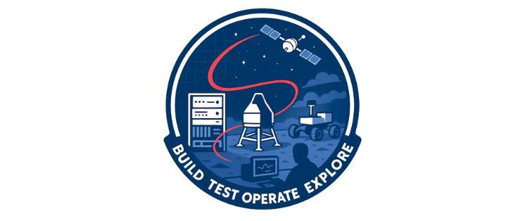

# Welcome to the Teamtools Studio Docs

The Teamtools Studio (TTS) is an effort originated in JPL's Mission Operations section in collaboration with Ground Software & Systems Engineering to centralize shared repositories across missions. This benefits JPL by reducing cost through reducing duplicated code, collaborating across missions, and unifying standards for development and design across JPL.

Although the effort is lead by Mission Operations, the TTS suite has been generalized and atomized to the point where many of these tools are applicable during other mission phases and even in non-spaceflight contexts. Through our work flying space missions, we hope to provide tools to the open source community that have utility in data analysis or planning for any complex system where failure is not an option.

## Who we are

Members of the Teamtools Studio come from organizations across the lab includling flight operations, systems testbeds, and more
niche groups like navigation, GNC, and robotics.

Many operators form throughout the project lifecycle at JPL interact with and use Teamtools Studio code, but there is also a core
team responsible for maintaining TTS code and strategizing around future improvements.

## Documentation Features

### GitHub Edit Links

Every page in the documentation includes a link at the bottom that takes you to the GitHub source file. This makes it easy to edit or comment on the documentation.

- Repository pages (generated from READMEs) include links to the repository, issues, and documentation.
- Other pages include a direct "Edit on GitHub" link.

## Contact

For more information, the JPL team can be reached via teamtools-studio@jpl.nasa.gov.

---
<a href="https://github.com/NASA-JPL-Teamtools-Studio/teamtools-documentation/blob/main/docs/index.md" target="_blank" rel="noopener noreferrer">Edit/Comment on GitHub</a>